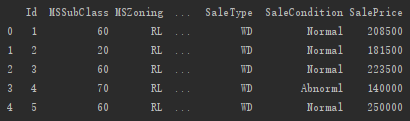
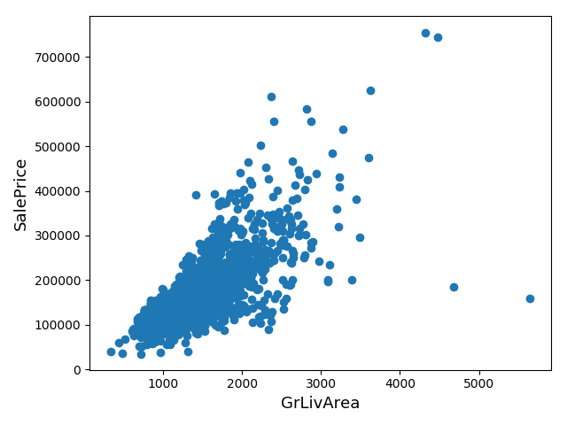
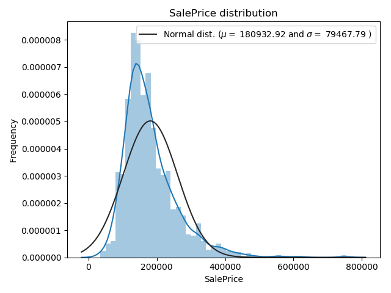
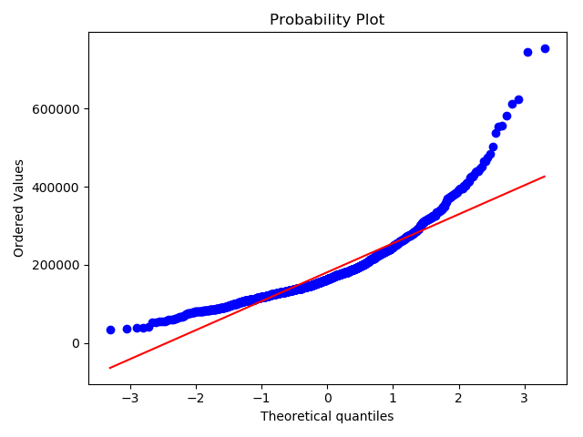
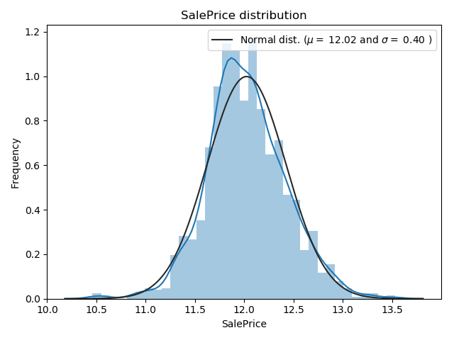
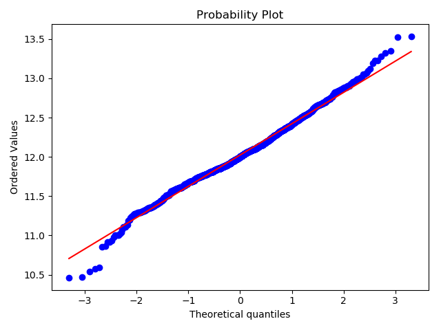
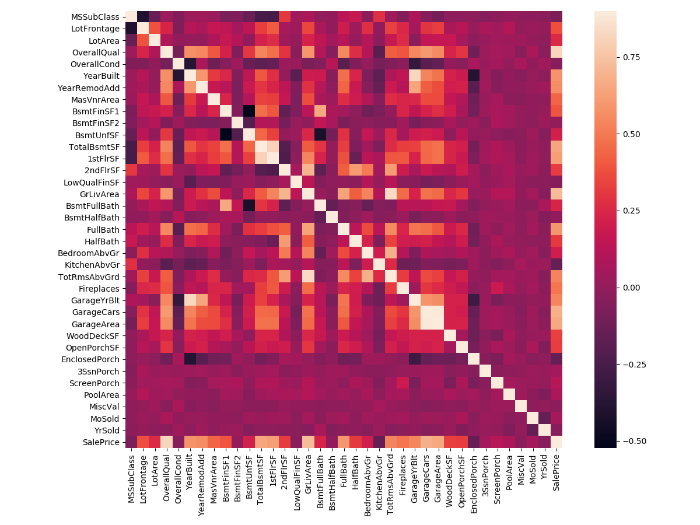
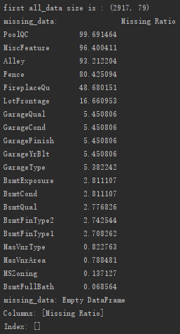
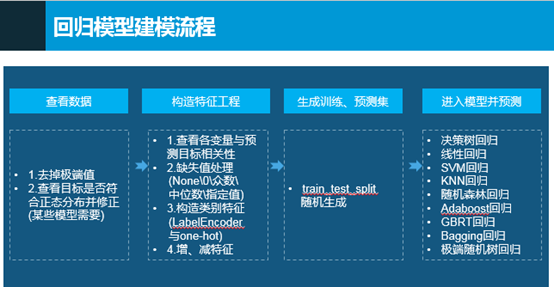

# 房价回归模型
python3
## 本文目的
1.机器学习的特征工程处理

2.各种回归模型的应用

本项目完整源码地址：[https://github.com/angeliababy/houseprice_regression](https://github.com/angeliababy/houseprice_regression)

项目博客地址: [https://blog.csdn.net/qq_29153321/article/details/103967670](https://blog.csdn.net/qq_29153321/article/details/103967670)

## 数据准备
数据来源是房价，来自kaggle练习数据集

train.csv训练集，test.csv预测集，sample_submission.csv预测输出样例文件


## 数据处理
文件代码
inference(contain pictures).py（分析含图片）
inference.py（分析不含图片）

**第一步，查看数据**
```
# 读取文件（文件中第一列id是标号，train.csv最后一列SalePrice（房价）是预测目标变量，中间是特征变量）
# 训练、测试集
train = pd.read_csv(r'train.csv')
# 预测集
test = pd.read_csv(r'test.csv')

# 前五行
print(train.head(5))
print(test.head(5))

# 保存数据第一行id
train_ID = train['Id']
test_ID = test['Id']
# 去掉id列
train.drop("Id", axis = 1, inplace = True)
test.drop("Id", axis = 1, inplace = True)
```
  
 
 1.查看数据大致情况，去掉极端值（离群点）
 ```
 fig, ax = plt.subplots()
ax.scatter(x = train['GrLivArea'], y = train['SalePrice'])
plt.ylabel('SalePrice', fontsize=13)
plt.xlabel('GrLivArea', fontsize=13)
plt.show()

# 由上图散点图分布，去掉面积大价格低的数据(极端值)
train = train.drop(train[(train['GrLivArea']>4000) & (train['SalePrice']<300000)].index)
```
 
   
  
2.查看预测样本价格是否符合正态分布并修正(某些模型需要，比如线性回归)
 ```
# SalePrice分布图
sns.distplot(train['SalePrice'] , fit=norm)
# SalePrice均值、均方差
(mu, sigma) = norm.fit(train['SalePrice'])
plt.legend(['Normal dist. ($\mu=$ {:.2f} and $\sigma=$ {:.2f} )'.format(mu, sigma)],
            loc='best')
plt.ylabel('Frequency')
plt.title('SalePrice distribution')

# QQ-plot（验证某两组数据是否来自同一分布，离的距离）
fig = plt.figure()
res = stats.probplot(train['SalePrice'], plot=plt)
plt.show()
```
      
 
 ```
 # 由上可知目标变量是右倾斜的，(线性)模型要转化为正态分布的数据
# 使用log(1+x)对SalePrice进行转化
train["SalePrice"] = np.log1p(train["SalePrice"])
```
      

**第二步，构造特征工程**

连接训练、预测数据
```
# 两文件数据量
ntrain = train.shape[0]
ntest = test.shape[0]
y_train = train.SalePrice.values
# 连接两个表，将两个表的数据共同处理
all_data = pd.concat((train, test)).reset_index(drop=True)
# 去掉目标变量SalePrice列
all_data.drop(['SalePrice'], axis=1, inplace=True)
```

1.查看各变量与预测目标相关性，按照右边颜色条进行判断
```
corrmat = train.corr()
plt.subplots(figsize=(12,9))
sns.heatmap(corrmat, vmax=0.9, square=True)
plt.show()
```
   
 
 2.缺失值处理
 ```
 # 查看各变量缺失率及降序排序
all_data_na = (all_data.isnull().sum() / len(all_data)) * 100
all_data_na = all_data_na.drop(all_data_na[all_data_na == 0].index).sort_values(ascending=False)[:30]
missing_data = pd.DataFrame({'Missing Ratio' :all_data_na})
print("missing_data:", missing_data.head(20)) # 列出前20个

# 填补缺失值，None\0\众数\中位数\指定值填充，或者去掉该列
for col in ('PoolQC', 'MiscFeature', 'Alley', 'Fence', 'FireplaceQu', 'GarageType', 'GarageFinish', 'GarageQual', 'GarageCond',
'BsmtQual', 'BsmtCond', 'BsmtExposure', 'BsmtFinType1', 'BsmtFinType2', 'MasVnrType'):
    all_data[col].fillna("None", inplace=True)
for col in ('GarageYrBlt', 'GarageArea', 'GarageCars', 'BsmtFinSF1', 'BsmtFinSF2', 'BsmtUnfSF', 'TotalBsmtSF', 'BsmtFullBath',
'BsmtHalfBath', 'MasVnrArea'):
    all_data[col].fillna(0, inplace=True)
for col in ('MSZoning', "Functional", 'Electrical', 'KitchenQual', 'Exterior1st', 'Exterior2nd', 'SaleType', 'MSSubClass'):
    all_data[col].fillna(all_data[col].mode()[0], inplace=True)
all_data.drop(['Utilities'], axis=1, inplace=True)
all_data["LotFrontage"] = all_data.groupby("Neighborhood")["LotFrontage"].transform(
    lambda x: x.fillna(x.median()))
```
   
  
  3.构造类别特征
```
# 数值变为类别
# 将这几个列的属性变为str类型，才可以进行下面编码处理
all_data['MSSubClass'] = all_data['MSSubClass'].apply(str)
all_data['OverallCond'] = all_data['OverallCond'].astype(str)
all_data['YrSold'] = all_data['YrSold'].astype(str)
all_data['MoSold'] = all_data['MoSold'].astype(str)

# 将某些特征进行标签编码LabelEncoder0,1,2···，对于回归问题，更多地使用labelEncoding。对于分类问题，更多使用OneHotEncoding。
from sklearn.preprocessing import LabelEncoder
cols = ('FireplaceQu', 'BsmtQual', 'BsmtCond', 'GarageQual', 'GarageCond',
        'ExterQual', 'ExterCond','HeatingQC', 'PoolQC', 'KitchenQual', 'BsmtFinType1',
        'BsmtFinType2', 'Functional', 'Fence', 'BsmtExposure', 'GarageFinish', 'LandSlope',
        'LotShape', 'PavedDrive', 'Street', 'Alley', 'CentralAir', 'MSSubClass', 'OverallCond',
        'YrSold', 'MoSold')
for c in cols:
    lbl = LabelEncoder()
    lbl.fit(list(all_data[c].values))
    all_data[c] = lbl.transform(list(all_data[c].values))
```
处理类别特征，LabelEncoder0,1,2···编码

4.组合特征，增加一个重要特征（可不用该步）
```
# 组合TotalBsmtSF、1stFlrSF、2ndFlrSF（地下室、一楼、二楼面积特征）
all_data['TotalSF'] = all_data['TotalBsmtSF'] + all_data['1stFlrSF'] + all_data['2ndFlrSF']
```

5.倾斜数值特征的变换，skew偏度，用boxcox1p处理（可不用该步）
```
# 将数值特征提取，即类型不为object
numeric_feats = all_data.dtypes[all_data.dtypes != "object"].index

# 列出数据的偏斜度，降序排序
skewed_feats = all_data[numeric_feats].apply(lambda x: skew(x.dropna())).sort_values(ascending=False)
print("\nSkew in numerical features: \n")
skewness = pd.DataFrame({'Skew' :skewed_feats})
print("skew:",skewness.head(10))

# 将偏斜度大于0.75的数值列做一个log转换，使之尽量符合正态分布，因为很多模型的假设数据服从正态分布
skewness = skewness[abs(skewness.Skew) > 0.75]
print("There are {} skewed numerical features to Box Cox transform".format(skewness.shape[0]))

from scipy.special import boxcox1p
skewed_features = skewness.index
lam = 0.15
for feat in skewed_features:
    all_data[feat] = boxcox1p(all_data[feat], lam)
print("LabelEncoder：all_data.shape:", all_data.shape)
```

6.将属性特征转化为指示变量，one-hot编码
```
all_data = pd.get_dummies(all_data)
print("one-hot：all_data.shape:", all_data.shape)
```

## 训练部分

**第三步，随机生成训练、测试集**
```
from sklearn.model_selection import train_test_split
train = inference.train   # 训练、测试总数据
y_train = inference.y_train # 目标变量
# 利用sklearn的train_test_split，test_size为测试集所占比例，train训练，test测试
X_train, X_test, y_train, y_test = train_test_split(
    train, y_train, random_state=42, test_size=.25)
```


具体模型选择
```
####3.1决策树回归####
from sklearn import tree
model_DecisionTreeRegressor = tree.DecisionTreeRegressor()
####3.2线性回归####
from sklearn.linear_model import LinearRegression, RidgeCV, LassoCV, ElasticNetCV
model_LinearRegression = LinearRegression()
model_RidgeCV = RidgeCV() # L1
model_LassoCV = LassoCV() # L2
model_ElasticNetCV = ElasticNetCV() # L1、L2组合
####3.3SVM回归####
from sklearn import svm
model_SVR = svm.SVR()
####3.4KNN回归####
from sklearn import neighbors
model_KNeighborsRegressor = neighbors.KNeighborsRegressor()
####3.5随机森林回归####
from sklearn import ensemble
model_RandomForestRegressor = ensemble.RandomForestRegressor(n_estimators=20)#这里使用20个决策树
####3.6Adaboost回归####
from sklearn import ensemble
model_AdaBoostRegressor = ensemble.AdaBoostRegressor(n_estimators=50)#这里使用50个决策树
####3.7GBRT回归####
from sklearn import ensemble
model_GradientBoostingRegressor = ensemble.GradientBoostingRegressor(n_estimators=100)#这里使用100个决策树
####3.8Bagging回归####
from sklearn.ensemble import BaggingRegressor
model_BaggingRegressor = BaggingRegressor()
####3.9ExtraTree极端随机树回归####
from sklearn.tree import ExtraTreeRegressor
model_ExtraTreeRegressor = ExtraTreeRegressor()
```

**第四步，进入模型**
```
from sklearn.metrics import mean_squared_error  # RMSE均方根误差
def try_different_method(model):
    model.fit(X_train,y_train)  # 拟合模型
    score = model.score(X_test, y_test)  # 模型评分
    result = model.predict(X_test)  # 测试集结果（目标变量）
    # 用expm1反转，因为之前做过正态处理log(1+x)
    # 测试集的均方根误差(真实目标变量与真实预测的目标变量比较)
    print('RMSE is: ', mean_squared_error(np.expm1(y_test), np.expm1(result)))
    # 模型评分
    print('score is: ', score)
    
###########4.具体模型调用部分##########
# 修改此处，单个验证每个模型的评分和RMSE
model = model_GradientBoostingRegressor
try_different_method(model)
```

# 预测
```
# 训练模型
model = train.model

# 预测数据集
test = inference.test
# 预测数据id列
test_ID = inference.test_ID
# 模型预测
predictions = model.predict(test)
# 对预测结果expm1反转，因为之前做过正态处理
final_predictions = np.expm1(predictions)
```

将结果存入submission.csv中
```
submission = pd.DataFrame()
submission['Id'] = test_ID
submission['SalePrice'] = final_predictions
submission.to_csv('submission.csv', index=False)
```

# 总结

                                      

最终各回归模型结果：

1.决策树

RMSE is:  532395123.562

score is:  0.90813547399

2.线性回归：

RMSE is:  586465281.565

score is:  0.893219242348

（L1）

RMSE is:  436414334.452

score is:  0.920259863505

（L2）

RMSE is:  1527408276.36

score is:  0.766068968204

（L1、L2组合）

RMSE is:  1530130424.34

score is:  0.76573898515

3.SVM回归：

RMSE is:  5877713733.54

score is:  0.102032293627

4.KNN回归：

RMSE is:  2286483436.42

score is:  0.64288565344

5.随机森林回归：

RMSE is:  636972220.385

score is:  0.878817100473

6.Adaboost回归：

RMSE is:  1027379040.37

score is:  0.825414370017

7.GBRT回归：

RMSE is:  535186953.04

score is:  0.907785830809

8.Bagging回归：

RMSE is:  716732962.826

score is:  0.867426082833

9.ExtraTree极端随机树回归：

RMSE is:  1424383100.16

score is:  0.69803288816